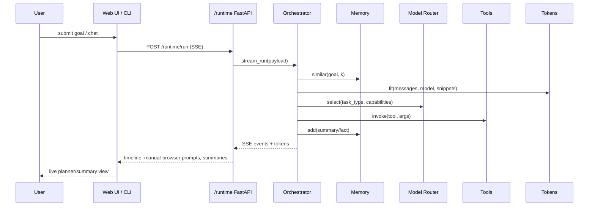

# Apple Zero Runtime

Apple Zero is the macOS-native evolution of the Cosmic Crisp / Agent Zero stack. It combines a unified FastAPI gateway, an async orchestrator with subagents, model-aware memory, and a declarative tool platform that runs entirely on the host (no Docker required).

## Table of Contents

1. [Architecture Overview](#architecture-overview)
2. [Quick Start](#quick-start)
3. [Configuration Essentials](#configuration-essentials)
4. [Memory & Context Management](#memory--context-management)
5. [Token Budgets & Context Fitting](#token-budgets--context-fitting)
6. [Subagents & Autonomy](#subagents--autonomy)
7. [UI & Human-in-the-Loop Browsing](#ui--human-in-the-loop-browsing)
8. [Observability & Logging](#observability--logging)
9. [Migration & Compatibility Notes](#migration--compatibility-notes)
10. [Testing](#testing)
11. [macOS Platform Notes](#macos-platform-notes)

---

## Architecture Overview

```mermaid
graph TD
    UI[Web UI / CLI] -->|REST & SSE| API[FastAPI Gateway (python/runtime/api/app.py)]
    API --> Container[Runtime Container (python/runtime/container.py)]
    Container --> Orchestrator[Agent Orchestrator]
    Container --> Tokens[Token Service]
    Container --> Memory[Composite Memory Store]
    Container --> ModelRouter[Model Router]
    Container --> Tools[Tool Registry]
    Container --> Prompts[Prompt Manager]
    Orchestrator --> Subagents[Subagent Manager]
    Orchestrator --> EventBus[Event Bus]
    Orchestrator --> Observability[Observability]
    ModelRouter -->|LiteLLM / LM Studio| Providers[Model Providers]
    Memory --> Embeddings[Embeddings Service]
    Tools --> Browser[Browser / Search / Code / Shell]
```



## Quick Start

### Prerequisites

- macOS 12+
- Python 3.10+
- Homebrew (installer in `dev/macos/setup.sh` will bootstrap if missing)

### Bootstrap

```bash
# 1. Install native dependencies, virtualenv, Playwright cache
./dev/macos/setup.sh

# 2. Launch the combined FastAPI + UI runtime
./dev/macos/run.sh

# 3. Open the web client
open http://localhost:8080
```

To run the FastAPI app directly without the helper script:

```bash
source venv/bin/activate
python -m python.runtime.api.app
```

## Configuration Essentials

Runtime configuration merges environment variables with an optional `runtime.toml`. The loader lives in `python/runtime/config.py` and exposes the following top-level sections: `embeddings`, `memory`, `tokens`, `prompts`, `observability`, `agent`, `tools`, and `router`.

| Key | Purpose | Example Overrides |
| --- | --- | --- |
| `EMBEDDINGS_PROVIDER`, `EMBEDDINGS_MODEL` | Configure embedding service (OpenAI, local LM Studio via LiteLLM) | `EMBEDDINGS_PROVIDER=openai`, `EMBEDDINGS_MODEL=text-embedding-3-large` |
| `MEM0_ENABLED`, `MEM0_API_KEY`, `MEM0_BASE_URL` | Enable hybrid Mem0 retrieval alongside SQLite | `MEM0_ENABLED=true` |
| `SUMMARIZER_MODEL`, `TOKEN_BUDGET_*` | Override default token budgets and summarizer model | `TOKEN_BUDGET_GPT_4O=196000` |
| `ROUTER_DEFAULT_MODEL`, `ROUTER_MODELS` | Declare routing policies and capabilities | `ROUTER_MODELS='[{"name":"gpt-4o-mini","priority":1}]'` |
| `HELICONE_ENABLED`, `HELICONE_BASE_URL`, `HELICONE_API_KEY` | Toggle Helicone proxy & observability headers | `HELICONE_ENABLED=true` |

### Sample `runtime.toml`

```toml
[embeddings]
provider = "openai"
model = "text-embedding-3-large"

[memory]
db_path = "./data/runtime.sqlite"
mem0_enabled = false

[tokens]
summarizer_model = "gpt-4.1-mini"

[router]
default_model = "gpt-4o"
default_strategy = "balanced"
[[router.models]]
name = "gpt-4o"
priority = 1
max_context = 128000
capabilities = ["general", "code"]

[[router.models]]
name = "lm-studio:gpt4all"
provider = "openai"
priority = 2
max_context = 32000
is_local = true
metadata.api_base = "http://localhost:1234/v1"
```

## Memory & Context Management

Apple Zero uses a composite memory stack (`python/runtime/memory`) combining a local SQLite+FAISS store with optional Mem0 hybrid retrieval.

| Provider | Model / Endpoint | Config Keys | Notes |
| --- | --- | --- | --- |
| OpenAI | `text-embedding-3-large` (default) | `EMBEDDINGS_PROVIDER=openai`, `EMBEDDINGS_MODEL=text-embedding-3-large` | High-quality embeddings, cached in `./tmp/embeddings.sqlite`. |
| LiteLLM → LM Studio | Example `text-embedding-3-small` served by LM Studio | `EMBEDDINGS_PROVIDER=local_mlx`, `EMBEDDINGS_MODEL=lm-studio`, set `OPENAI_BASE_URL` to LM Studio server | Uses LiteLLM-compatible REST API. |
| Null | Deterministic stub for tests | `EMBEDDINGS_PROVIDER=null` | Returns fixed vectors for offline testing. |

### Mem0 Hybrid Retrieval

Set the following to enable Mem0 alongside the local store:

```env
MEM0_ENABLED=true
MEM0_API_KEY=your_mem0_token
MEM0_BASE_URL=https://your-mem0-host
```

When enabled, the adapter merges remote results with the local SQLite store and defers reindex operations to the fallback store when possible.

### CLI Tools

Two helper CLIs ship with the runtime:

```bash
# Rebuild vectors for all (or a specific) sessions
python -m python.runtime.tools.reindex_memory --verbose
python -m python.runtime.tools.reindex_memory --session research-2024

# Import legacy JSON/NDJSON exports into the new store
python -m python.runtime.tools.migrate_memory ./memory-exports --session backlog --kind fact
```

Both utilities respect your environment configuration and will load embeddings/memory using the same runtime container settings.

## Token Budgets & Context Fitting

`python/runtime/tokenizer/token_service.py` manages window fitting. Default budgets ship with the runtime and can be overridden via `runtime.toml` or environment variables.

| Model (normalized) | Default Window |
| --- | --- |
| `gpt-4o` | 128,000 |
| `gpt-4.1-mini` | 64,000 |
| `claude-3-5` | 200,000 |
| `gemini-2.5-pro` | 1,000,000 |
| `local-mlx` | 8,192 |

Override options:

- Inline JSON: `TOKEN_BUDGETS='{"gpt-4o":196000, "claude-3-5":180000}'`
- Per-model env: `TOKEN_BUDGET_GPT_4O=196000`
- Default summarizer: `SUMMARIZER_MODEL=claude-3-5`

The service preserves the system prompt, injects summarised memory snippets, and trims conversation history. Summaries are emitted as synthetic `system` messages annotated with "Conversation summary".

## Subagents & Autonomy

The orchestrator (`python/runtime/agent/orchestrator.py`):

- Runs a goal → analyze → execute → summarize loop.
- Seeds a `TaskPlanner` priority queue and persists task outcomes to memory.
- Spawns subagents for tool classes such as `browser` and `code`, respecting `AGENT_SUBAGENT_MAX_DEPTH` and `AGENT_SUBAGENT_TIMEOUT` from `AgentConfig`.
- Streams events via the `EventBus` for the UI timeline (`task_started`, `tool_start`, `browser_hil_required`, etc.).

Tune behaviour via environment variables:

```env
AGENT_MAX_LOOPS=25
AGENT_SUBAGENT_MAX_DEPTH=2
AGENT_SUBAGENT_TIMEOUT=90
AGENT_PERSONA=concise
```

## UI & Human-in-the-Loop Browsing

The React web UI consumes `/runtime` SSE streams to render:

- Planner timeline (tasks, analysis, tool invocations)
- Memory recalls and summaries per run
- Token stream output with model attribution
- Manual browser takeover prompts (`/runtime/browser/continue`) when the `browser` tool encounters a CAPTCHA or block after two failed attempts
- Configuration widgets for persona, autonomy level, and model selection (ties into router overrides)

Manual intervention flow:
1. UI receives `browser_hil_required` event.
2. Operator completes the task manually (e.g., solves CAPTCHA).
3. Submit context back via `/runtime/browser/continue` to resume execution.

## Observability & Logging

`python/runtime/observability.py` unifies metrics, JSON logging, and Helicone proxy headers.

- JSON logs: `./logs/runtime_observability.jsonl`
- Prometheus endpoint: `GET /runtime/admin/metrics` (enable admin auth if required)
- Helicone: set `HELICONE_ENABLED=true`, `HELICONE_BASE_URL=https://helicone.yourhost`, `HELICONE_API_KEY=...`

Each model call is tagged with session/run/token metadata, and counters expose run/task/tool/memory/token statistics. When Helicone is enabled the router hands back the appropriate `Helicone-*` headers for downstream logging.

## Migration & Compatibility Notes

### Importing Legacy Memory

```bash
# Convert legacy exports (memory/*.json, memory/*.ndjson)
python -m python.runtime.tools.migrate_memory ./memory --session archive-2023 --kind fact

# Rebuild vectors after import
python -m python.runtime.tools.reindex_memory --verbose
```

### Configuring Models

- **OpenAI / Azure / Anthropic:** supply API keys via `.env` (`OPENAI_API_KEY`, `ANTHROPIC_API_KEY`, etc.) and add entries under `router.models` for routing policies (cost, latency, capabilities).
- **Google Gemini:** configure LiteLLM provider keys (`GEMINI_API_KEY`) and register the Gemini model in `router.models` with `provider="google"`.
- **Local LM Studio / Ollama:** expose the server as an OpenAI-compatible endpoint (e.g., http://localhost:1234/v1) and set `metadata.api_base` for that router entry. Mark `is_local=true` to allow the router to prefer remote models unless `allow_local=True` is specified.

### Environment Variables Cheat Sheet

| Purpose | Variable(s) |
| --- | --- |
| Memory location | `MEMORY_DB_PATH=./data/runtime.sqlite` |
| Mem0 hybrid | `MEM0_ENABLED=true`, `MEM0_API_KEY=...`, `MEM0_BASE_URL=...` |
| Router overrides | `ROUTER_MODELS`, `ROUTER_DEFAULT_MODEL`, `ROUTER_DEFAULT_STRATEGY` |
| Token budgets | `TOKEN_BUDGETS`, `TOKEN_BUDGET_<MODEL>`, `SUMMARIZER_MODEL` |
| UI flags | `AGENT_PERSONA`, `AGENT_MAX_LOOPS`, `AGENT_PLANNER_PROFILE` |
| Observability | `HELICONE_*`, `OBSERVABILITY_LOG_PATH`, `OBSERVABILITY_METRICS_NS` |

## Testing

A focused runtime test suite lives under `tests/runtime/`:

- `test_embeddings_cache.py` – cache hit/miss and batching behaviour
- `test_memory_recall.py` – FAISS similarity and Mem0 fallback
- `test_token_fit.py` – budget trimming and summarisation
- `test_loop_integration.py` – orchestration loop integration
- `test_tool_browser.py` – browser-use retries and human-in-loop escalation
- `test_prompt_manager.py` – overrides, personas, adaptive hints
- `test_model_router.py` – routing policies, telemetry headers

Run all runtime tests with:

```bash
PATH="$(realpath ../.pytest-venv/bin):$HOME/bin:$PATH" \
PYTHONPATH="$(pwd)" \
python -m pytest tests/runtime -q
```

## macOS Platform Notes

- Native PTY support (no Docker) lives under `python/adapters/terminal/macos_pty.py` and the terminal manager still powers the web terminal.
- Voice features now use Chatterbox (`python/helpers/chatterbox_tts.py`) with configurable emotion, CFG, language, and reference voice settings; disable via `ENABLE_TTS=false` in `.env` if you prefer browser TTS only.
- Playwright browsers are installed into `./tmp/playwright` by the setup script; override with `PLAYWRIGHT_BROWSERS_PATH` if you need a shared cache.

For deeper customization, inspect `python/runtime/container.py` to see how singletons are bootstrapped and cached across the runtime.
